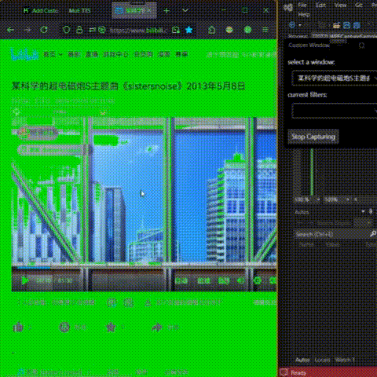

# Custom Shader Filter Window

----

a rough WPF application, allows you to:

add a *topmost click-through **customizable PixelShader layer window*** to a *specified original window*.

which may makes some interesting (or practical) operations possible.

## 0: preview:

### 0.0: FilterWindow:

1. allow *some program windows that lack native dark mode support* to display in a custom dark mode imperfectly.

    

    example code of `PixelShader.hlsl`:

    ```hlsl
    Texture2D inputTexture : register(t0);
    SamplerState samplerState : register(s0);

    struct PS_INPUT
    {
        float4 position : SV_POSITION;
        float2 texcoord : TEXCOORD;
    };

    float Luminance(float3 color)
    {
        return 0.299 * color.r + 0.587 * color.g + 0.114 * color.b;
    }

    float4 PS(PS_INPUT input) : SV_Target
    {
        // sample the texture
        float4 color = inputTexture.Sample(samplerState, input.texcoord);

        // since the topmost filter window is not perfect, I prefer to let the content rendered as semi-transparent, allow us to see the content covered by the filter window
        color.a = 0.5;

        // calculate luminance
        float luminance = Luminance(color.rgb);

        if (luminance >= 0.8)
        {
            // darken the bright part
            color.rgb *= 0.2;
        }
        else
        {
            // to fit the semi-transparent display, otherwise the original value will be doubled
            color.rgb *= 0.5;
        }

        return color;
    }
    ```

2. some other custom PixelShader rules.

    

    example code of `PixelShader.hlsl`:

    ```hlsl
    Texture2D inputTexture : register(t0);
    SamplerState samplerState : register(s0);

    struct PS_INPUT
    {
        float4 position : SV_POSITION;
        float2 texcoord : TEXCOORD;
    };

    float Luminance(float3 color)
    {
        return 0.299 * color.r + 0.587 * color.g + 0.114 * color.b;
    }

    float4 PS(PS_INPUT input) : SV_Target
    {
        // sample the texture
        float4 color = inputTexture.Sample(samplerState, input.texcoord);

        // calculate luminance
        float luminance = Luminance(color.rgb);

        if (luminance >= 0.8)
        {
            // replace the bright part by a solid green color
            color.rgb = float3(0.0, 1.0, 0.0);
        }

        return color;
    }
    ```

## 1: known issues

- rendered content may not appear sufficiently clear.

- some floating content of the original window (e.g. context menus) will pass through the Shader window and cannot be captured or covered.

- other windows will be covered by the Shader window. (imperfectly fixed by semi-transparent rendered)

- rendered content and the FilterWindow may have a little offset to the original window.

## about

the entire project is roughly rewritten heavily based on the original project: [Windows.UI.Composition-Win32-Samples/dotnet/WPF/ScreenCapture](https://github.com/microsoft/Windows.UI.Composition-Win32-Samples/tree/master/dotnet/WPF/ScreenCapture).

## design objectives and approach

the pain point I initially wanted to address was: 

one of my audio processing plugins, which did not provide a comfortable dark mode, as a result, when I had to stare at its bright white background for extended periods, it caused my eyes great fatigue and discomfort.

and similar situations are not uncommon in my work, including but not limited to some web pages, Excel spreadsheets, and traditional professional software that lack dark mode support. 

after some thought, I realized that modifying each of these diverse software programs, which have different development and rendering architectures, is a difficult and labor-intensive task. 

however, they all share a commonality: they display content as windows. 

therefore, I believe there is some room for operation at the process or end of the display rendering.

I explored Vulkan and OpenGL, also referenced some implementations in OBS Studio, I finally chose Direct3D 11 because it seems to perform well and is more widely used and native on Windows systems. 

initially, I wanted to develop a Win32 desktop application using C++, but as a UI/UX designer with little programming experience and completely no background in D3D or computer graphics, I found it challenging to produce effective results after several attempts. 

therefore, I shifted my focus to C# WPF applications, which I had dabbled in a few years ago (I had previously created a rudimentary mini-browser with WPF and CEFSharp that supported semi-transparency, click-through, and topmost functionality), and eventually settled on this approach.

### workflow overview

1. select a opened window as the source window.
2. capture its content.
3. before the content being rendered, apply a custom shader to it.
4. render the content to a topmost click-through window at the same position and size of the source window.